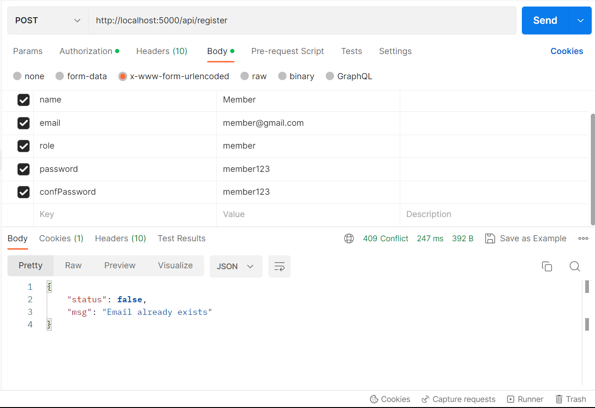
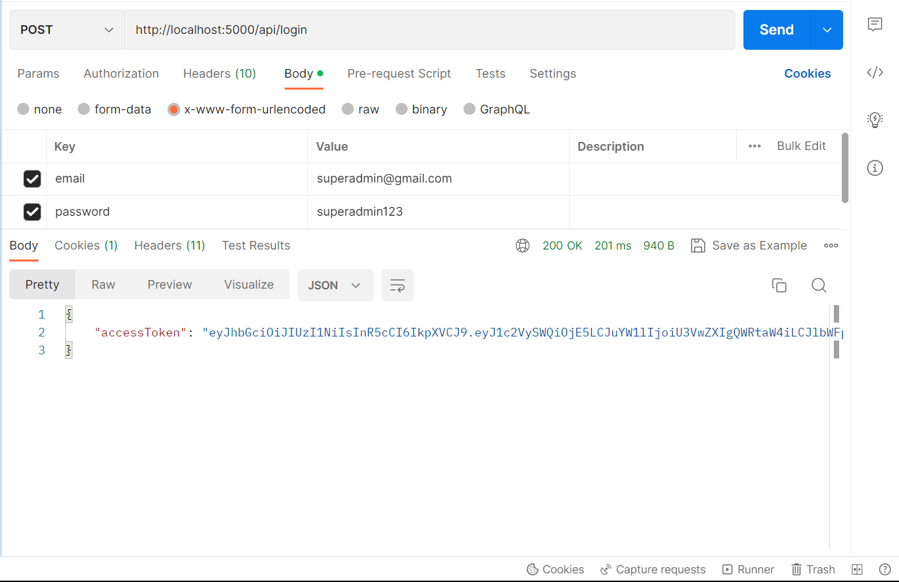
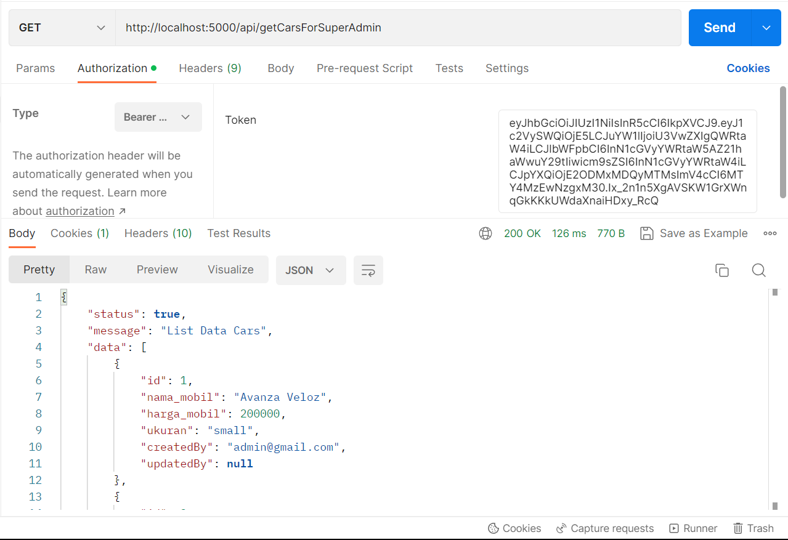
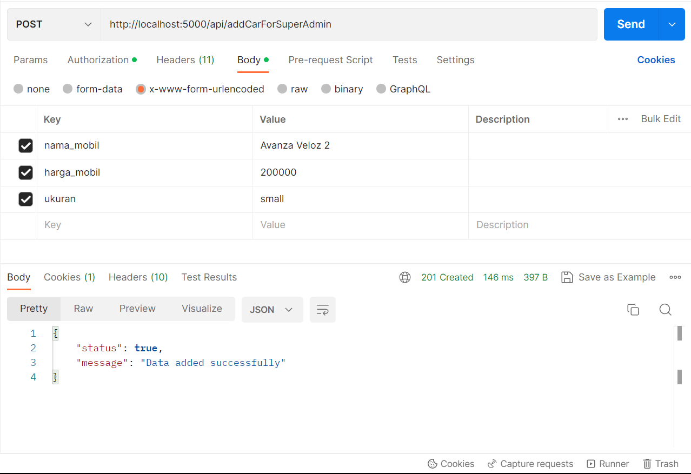
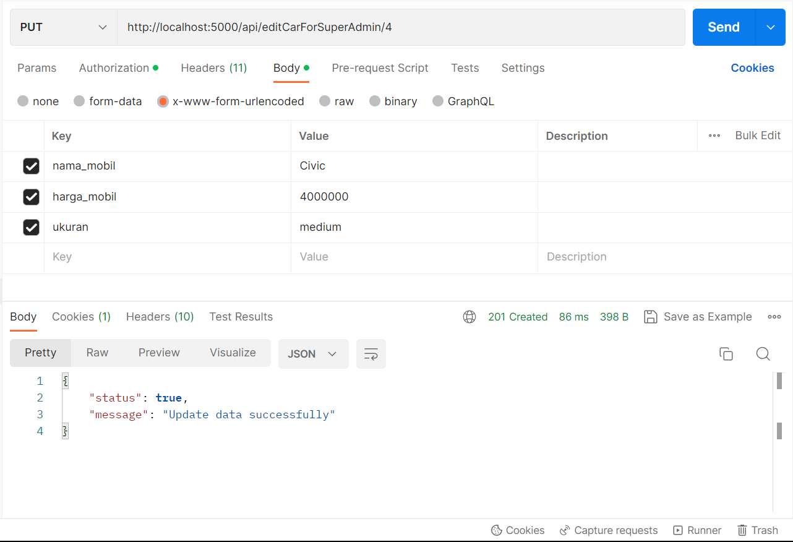
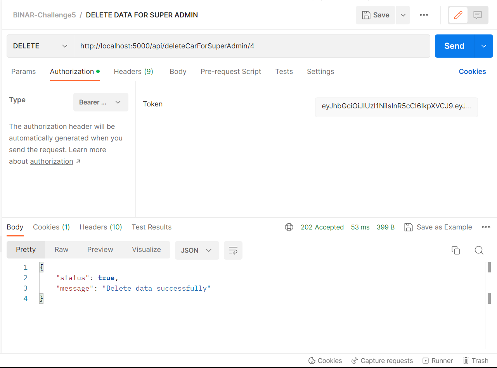

# BINAR-Challenge5 - Membuat Open API Documentation dari REST API
Membuat sebuah REST API yang dapat digunakan untuk melakukan manajemen data mobil dengan fitur authentication

# ENDPOINT REST API 

* Register
> POST http://localhost:5000/v1/api/register  
>  
> Contoh Request & Response Body  
>   

> Jika mendapatkan error seperti di gambar makan gunakan email lain.

* Login
> POST http://localhost:5000/v1/api/login  
>  
> Contoh Request & Response Body  
>   

> akan menghasilkan access token yang nantinya akan digunakan untuk melakukan CRUD untuk admin dan superadmin.
>
* Tampil Data 
> GET http://localhost:5000/v1/api/getCars
>  
> Contoh Request & Response Body  
>   

> Salin access token tadi di Authorization dan pilih typenya Bearer Token kemudian paste kan di Token 
  
  
* Tambah Data 
> POST http://localhost:5000/v1/api/addCarForSuperAdmin   
>  
> Contoh Request & Response Body  
>   

> Salin access token tadi di Authorization dan pilih typenya Bearer Token kemudian paste kan di Token 

* Ubah Data 
> PUT http://localhost:5000/v1/api/editCarForSuperAdmin/4  
>  
> Contoh Request & Response Body  
>   

> Salin access token tadi di Authorization dan pilih typenya Bearer Token kemudian paste kan di Token 

* Hapus Data 
> DELETE http://localhost:5000/v1/api/deleteCarForSuperAdmin/4
>  
> Contoh Request & Response Body  
>   

> Salin access token tadi di Authorization dan pilih typenya Bearer Token kemudian paste kan di Token 

* Tambah Data Admin (Khusus Role SuperAdmin)
> POST http://localhost:5000/v1/api/addUser
>  
> Contoh Request & Response Body  
>   

> Jika error seperti di gambar maka silakan gunakan email lain.
  
