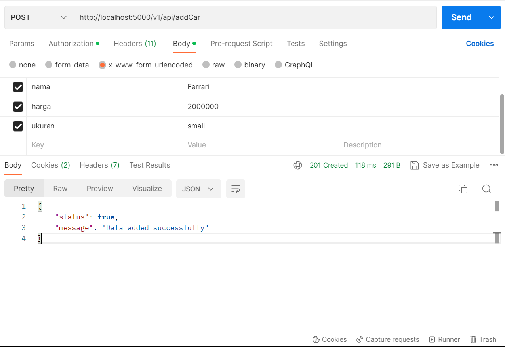

# BINAR-Challenge5 - Membuat Open API Documentation dari REST API
Membuat sebuah REST API yang dapat digunakan untuk melakukan manajemen data mobil dengan fitur authentication

# LINK PUBLISH API
https://documenter.getpostman.com/view/21213638/2s93eX1tGd

# ENDPOINT REST API 

* Register
> POST http://localhost:5000/v1/api/register  
>  
> Contoh Request & Response Body  
>   

> Jika mendapatkan error seperti di gambar makan gunakan email lain.

* Login
> POST http://localhost:5000/v1/api/login  
>  
## Email dan Password Admin : 
>
email: admin@gmail.com
>
password: admin123
>
## Email dan Password SuperAdmin : 
>
email: superadmin@gmail.com
>
password: superadmin123
>
## Email dan Password Member : 
>
email: member@gmail.com
>
password: member123
>
> Contoh Request & Response Body  
>

> akan menghasilkan access token yang nantinya akan digunakan untuk melakukan CRUD untuk admin dan superadmin.
>
* Tampil Data 
> GET http://localhost:5000/v1/api/getCars
>  
> Contoh Request & Response Body  
>   

> Salin access token tadi di Authorization dan pilih typenya Bearer Token kemudian paste kan di Token 
  
  
* Tambah Data 
> POST http://localhost:5000/v1/api/addCar
>  
> Contoh Request & Response Body  
>   

> Salin access token tadi di Authorization dan pilih typenya Bearer Token kemudian paste kan di Token 

* Ubah Data 
> PUT http://localhost:5000/v1/api/editCar/4  
>  
> Contoh Request & Response Body  
>   

> Salin access token tadi di Authorization dan pilih typenya Bearer Token kemudian paste kan di Token 

* Hapus Data 
> PUT http://localhost:5000/v1/api/deleteCar/4
>  
> Contoh Request & Response Body  
>   

> Salin access token tadi di Authorization dan pilih typenya Bearer Token kemudian paste kan di Token 

* Tambah Data Admin (Khusus Role SuperAdmin)
> POST http://localhost:5000/v1/api/addUser
>  
> Contoh Request & Response Body  
>   

  
